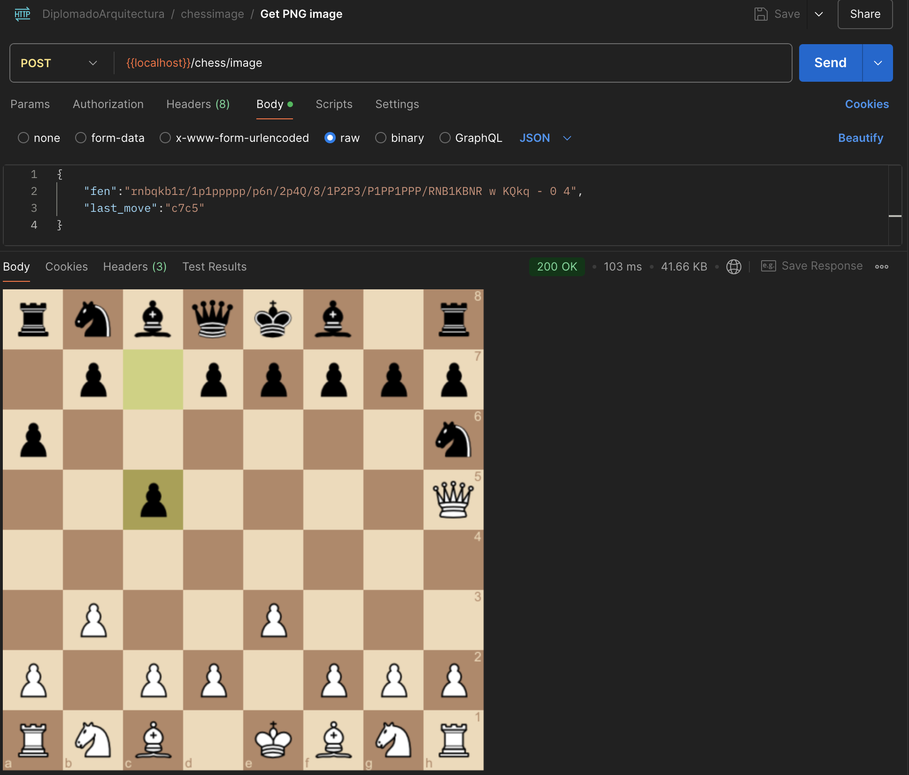
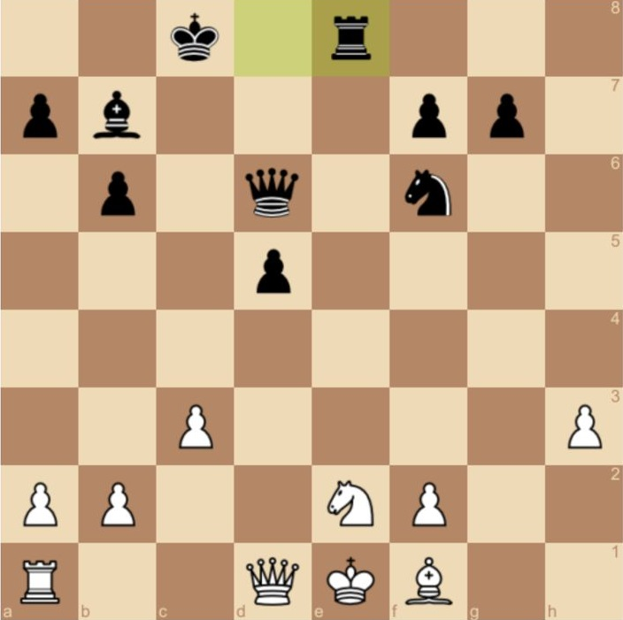

# Chess Image Generator

Golang project for rendering a chess board PNG in specific state.

# Go Starter App


POC of a basic implementation of the [chessimage library](https://github.com/cjsaylor/chessimage) with the objective of exposing a service that receives a FEN and returns its associated image.

> FEN: System used in chess to save the current position of the game

## Available Endpoints

* **__POST_ /chess/image_**

## Tests and operation of the circuit breaker pattern

### Test Description

**Test data:**

You can use the [FEN Generator](http://bernd.bplaced.net/fengenerator/fengenerator.html) 

You can use the tool to generate a particular FEN or a random FEN, in order to test the service

> FEN: System used in chess to save the current position of the game

### Test objective(s)

Given a FEN and the information of the last move (optional) the image with the current position of the chess game must be returned

### Steps implemented to carry out the test

First of all, take a look at the `First steps` section to configure your environment and run the test locally.

Run this CURL:

```
curl --location 'http://localhost:8080/chess/image' \
--header 'Content-Type: application/json' \
--data '{
    "fen":"rnbqkb1r/1p1ppppp/p6n/2p4Q/8/1P2P3/P1PP1PPP/RNB1KBNR w KQkq - 0 4",
    "last_move":"c7c5"
}'
```

> last_move: The last move of the game, it corresponds to the square in the following order: FromTo. For example:
> The piece was moved from square c7 to square c5

Response:



### Technologies used in the test (specify languages, libraries)


We use [chessimage library](https://github.com/cjsaylor/chessimage)

Example:



### Results / Conclusions

It is evident that the chessimage library is fully functional and that this implementation is just a link in a much larger system, since the objective is that the service call is from a HUB that will send the FENs that are desired to be displayed on a Web Page.
